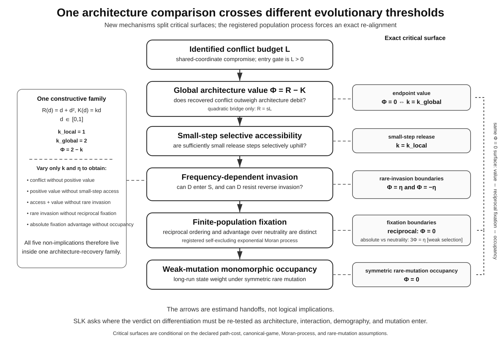
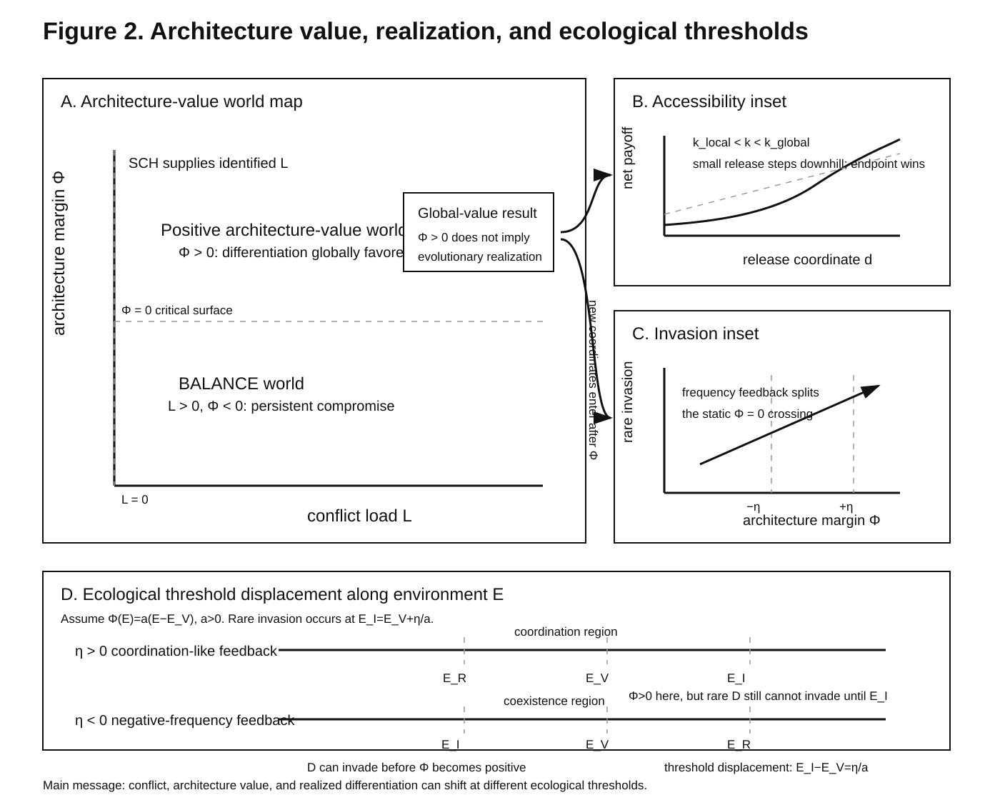
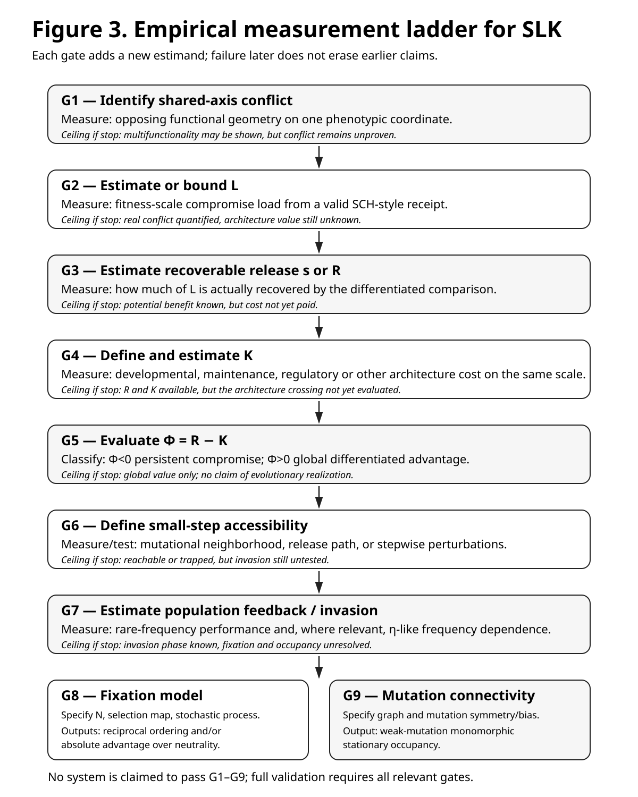

# SLK — From Shared Conflict to Evolutionary Architecture

SLK is the integrated flagship theory programme connecting four previously separate repositories:

- [`sch`](https://github.com/zuizui0223/sch): identifies whether a shared-coordinate functional conflict exists and estimates its compromise load `L`.
- [`balance`](https://github.com/zuizui0223/balance): classifies the persistent-compromise region `L > 0, Phi < 0`.
- [`bita`](https://github.com/zuizui0223/bita): defines recoverable architecture benefit `R` and the architecture margin `Phi = R - K`; under the quadratic partial-release bridge, `R=sL`.
- [`payoff`](https://github.com/zuizui0223/payoff): transports architecture payoff into accessibility, invasion, fixation, and long-run occupancy.

The integrated spine is:

```text
SCH      identifies L
BALANCE classifies L > 0, Phi < 0
BITA    defines/tests R and Phi = R - K
        with R = sL as a quadratic bridge
PAYOFF  maps Phi into evolutionary outcomes
```

## Central question

> When multiple biological functions are forced to share one phenotypic coordinate, when is differentiation worth its architecture-specific cost, and when does that global advantage actually become an evolutionary outcome?

## Core hierarchy

```text
shared functional conflict
        |
        v
conflict load L
        |
        v
recoverable benefit R
        |
        +-- quadratic bridge: R = sL
        |
        v
architecture margin Phi = R - K
        |
        +-- L > 0, Phi < 0: persistent compromise / BALANCE
        +-- Phi = 0: architecture critical surface
        +-- Phi > 0: differentiation globally favored / BITA
        |
        v
local accessibility
        |
        +-- globally favored but locally inaccessible
        |
        v
population transport
        |
        +-- rare invasion
        +-- fixation
        +-- weak-mutation occupancy
```

The flagship is not a claim that every adjacent criterion differs. It contains both sharp splits and a process-level invariant:

```text
L>0                         !=> Phi>0
Phi>0                       !=> local accessibility
accessible + Phi>0          !=> rare invasion
rare invasion               !=> reciprocal fixation superiority
absolute fixation advantage !=> greater weak-mutation occupancy

but, under the registered symmetric rare-mutation exponential-Moran process,

reciprocal fixation ordering <=> stationary monomorphic occupancy ordering.
```







The three figures have distinct jobs. Figure 1 shows the inferential hierarchy and its split/invariant structure. Figure 2 shows the coordinate geometry and why accessibility and invasion cannot be collapsed into the `L-Phi` plane. Figure 3 shows the empirical gate sequence required to justify progressively stronger biological claims.

## What SLK owns

SLK owns only the cross-repository theory needed for the integrated hierarchy:

1. identification and interpretation of the conflict budget `L`;
2. the persistent-compromise classification `L > 0, Phi < 0`;
3. the general architecture payoff identity `Phi=R-K`, with `R=sL` retained only as the quadratic partial-release bridge;
4. the distinction between global architecture value and local evolutionary accessibility;
5. the minimal transport from architecture payoff to invasion, fixation, and occupancy;
6. the integrated split/invariant theorem showing where successive criteria diverge and where reciprocal fixation and weak-mutation occupancy re-align;
7. the cumulative empirical-gate logic `G1-G9` that states what additional evidence is required for stronger biological claims.

The flagship never uses `Phi>0` as shorthand for "differentiation evolves". Every later stage has its own gate.

## Prior-art boundary

SLK does **not** claim to originate modularity/evolvability theory, functional specialization/division-of-labor theory, invasion-versus-fixation distinctions, or weak-mutation long-run population theory. The first registered boundary explicitly acknowledges Wagner & Altenberg (1996), Rueffler, Hermisson & Wagner (2012), Taylor et al. (2004), and Fudenberg et al. (2006).

The narrower novelty claim is the **architecture-specific estimand transport** from an identified shared-coordinate conflict budget through recoverable benefit and architecture value to evolutionary realization, together with explicit witness regimes for genuine separations, an exact process-level invariant where criteria re-align, and a gate-by-gate empirical claim ceiling.

## Architecture cost K

`K` is the net optimized fitness debit attributable to the differentiated architecture relative to its matched pre-cost comparison, on the same fitness scale and time horizon as `R`. It is comparison-specific rather than a universal physiological quantity. Empirical use must declare comparison states, scale, time horizon, included/excluded cost channels, uncertainty, and how double counting with `R` was prevented. See `docs/K_OPERATIONAL_DEFINITION_V1.md`.

## What SLK deliberately does not absorb

The sister repositories remain active and now develop their residual independent contributions:

- **SCH:** causal identification of contextual versus pure-function optima; multifunctionality-versus-conflict inference; empirical crossed-design programme.
- **BALANCE:** middle-world geometry, direct worldline identification, reserve/depth/topology, and persistence/hysteresis methods.
- **BITA:** ecological mechanism identification after differentiation; interaction-versus-mechanism inference; partial-identification workflow; full quadratic/nonquadratic architecture derivations beyond the minimum SLK bridge.
- **PAYOFF:** continuous architecture, evolutionary branching, edgewise modularization/topology, and spatial/temporal spectral dynamics.

Those topics may be cited by SLK but are not required for the flagship proof spine.

## Canonical reader path

1. `manuscript/SLK_MANUSCRIPT_V0.md` — integrated manuscript draft with C1-C9/INV1 labels and Figures 1-3.
2. `figures/FIG1_LOGIC_DIAGRAM.svg` — flagship logic figure: split points plus fixation-occupancy invariant.
3. `figures/FIG2_PHASE_MAP.svg` — architecture-value phase map plus conditional accessibility/invasion insets.
4. `figures/FIG3_EMPIRICAL_LADDER.svg` — cumulative empirical measurement ladder G1-G9.
5. `theory/NON_EQUIVALENCE_THEOREM_V1.md` — explicit counterexample regimes and invariant.
6. `theory/SLK_CORE_THEORY_V1.md` — minimal mathematical spine.
7. `docs/THEOREM_CLAIM_LEDGER_V1.md` — theorem/corollary/empirical-handoff status for every flagship claim.
8. `docs/SECTION_CLAIM_MAP_V1.md` — manuscript section-to-claim map and prose-promotion rule.
9. `docs/CLAIM_PROVENANCE_PINNED_V1.md` — source files and provenance commits pinned claim by claim.
10. `docs/K_OPERATIONAL_DEFINITION_V1.md` — operational definition and empirical receipt for `K`.
11. `docs/EMPIRICAL_G1_G9_SOURCE_LEDGER_V1.md` — source-adjudicated map of existing biological systems onto G1-G9, with explicit direct/partial/analogue/reality ceilings.
12. `docs/PRIOR_ART_BOUNDARY_V1.md` — novelty boundary across modularity/specialization and population-process prior art.
13. `docs/AMNAT_REVIEWER_RISK_AUDIT_V1.md` — skeptical-reviewer audit and remaining submission risks.
14. `docs/OWNERSHIP_AND_HANDOFF.md` — claim ownership and anti-duplication boundary.
15. `docs/PAPER_ROADMAP.md` — flagship and residual-paper programme.
16. `PROVENANCE.md` — migration provenance and citation policy.

## Current status

```text
INTEGRATED_SPINE_DEFINED
FLAGSHIP_MANUSCRIPT_GENERALIZED_TO_PHI_EQUALS_R_MINUS_K
NON_EQUIVALENCE_THEOREM_REGISTERED
FIXATION_OCCUPANCY_INVARIANT_REGISTERED
FIGURE_1_REGISTERED
FIGURE_2_REGISTERED
FIGURE_3_REGISTERED
PHASE_COORDINATE_BOUNDARY_REGISTERED
EMPIRICAL_GATE_LADDER_REGISTERED
EMPIRICAL_SOURCE_SYSTEM_LEDGER_REGISTERED
K_OPERATIONAL_DEFINITION_REGISTERED
PRIOR_ART_BOUNDARY_EXPANDED
FIRST_AMNAT_REVIEWER_REPAIR_ROUND_COMPLETE
CORE_THEORY_MIGRATED_CONCEPTUALLY
THEOREM_CLAIM_LEDGER_REGISTERED
SECTION_CLAIM_MAP_REGISTERED
CLAIM_PROVENANCE_PINNED
SOURCE_REPOSITORIES_HAVE_RESIDUAL_MANUSCRIPT_V0S
EMPIRICAL_CLAIM_CEILING_UNCHANGED
```

SLK does not turn theoretical quantities into empirical measurements by declaration. Any empirical use of `L`, `R`, `s`, `K`, `Phi`, accessibility, invasion, fixation, or occupancy must retain the identification requirements and uncertainty of the source analysis.