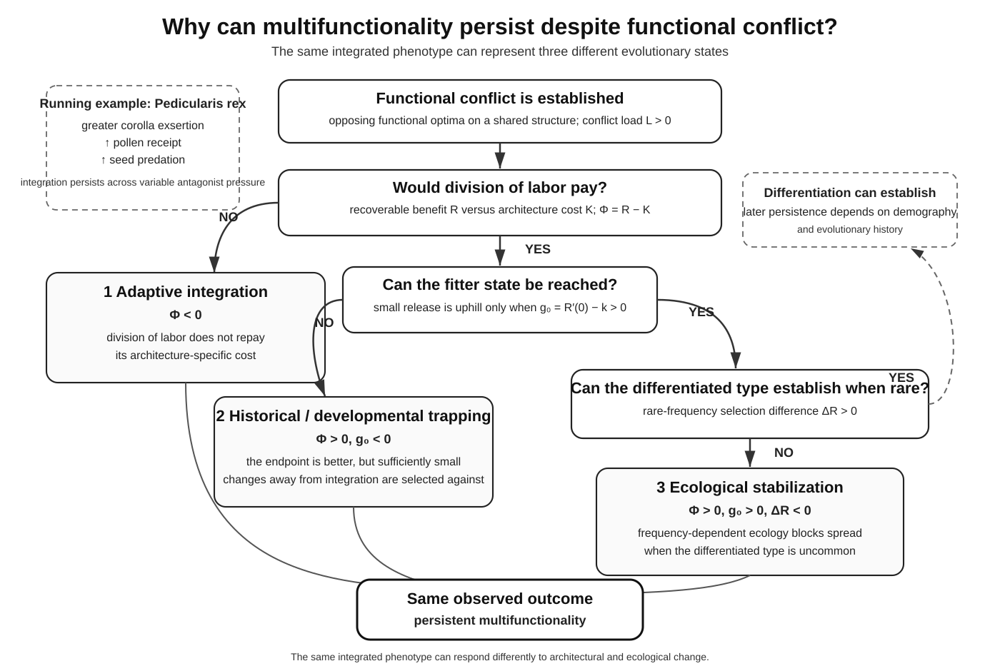
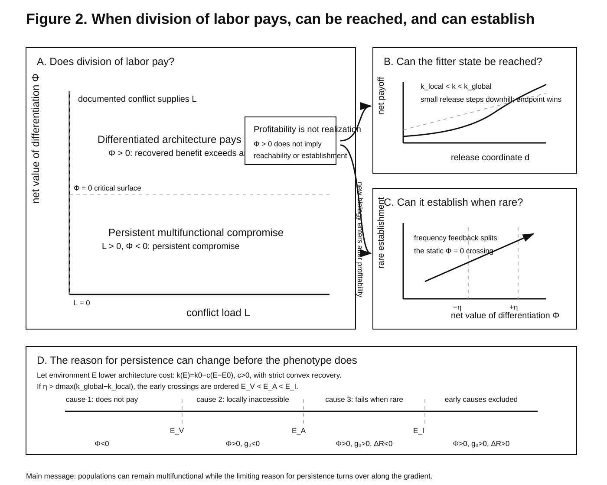

# Why multifunctional structures persist under conflicting selection

## Abstract

Functional conflicts have multiple evolutionary resolutions: functions can remain integrated, be partitioned among specialized modules, or be separated in time or ecological context. Why does nature use different solutions to similar conflicts? We distinguish three ways a multifunctional architecture can persist: differentiation may not repay its structural or regulatory cost; a fitter divided state may lie beyond selectively unfavorable intermediates; or ecological interactions may prevent a favorable divided type from spreading when rare. Thus conflict strength alone cannot predict biological organization. Our specific prediction is that environmental change can alter the selective reason for persistence before morphology changes: integration can shift from adaptive compromise, to historical trapping, to ecological stabilization as different evolutionary boundaries are crossed. Natural systems support the broader premise. Similar pollen conflicts are resolved by functional heteranthery, temporal pollen dosing, or both; pollinator identity shifts presentation strategies; and ecological context can reverse the fitness effect of rarity or re-couple anatomically decoupled structures. Functional conflict creates the problem, but architecture, history, and ecology determine its resolution.

## 1. Introduction

In the subalpine herb *Pedicularis rex*, tubular flowers are subtended by cup-like bracts that hold rainwater. The water protects developing fruits from seed predators, but pollinators favor greater corolla exsertion above the protective bracts. Across 14 populations, greater exsertion was associated with greater pollen receipt and also with greater seed predation: the same floral axis is pulled in opposite directions by mutualists and antagonists (Sun, Armbruster, and Huang 2016). Experimentally draining the bracts increased seed predation, confirming that the water-filled structure contributes to defense (Sun and Huang 2015). This is a concrete multifunctional compromise. The interesting evolutionary question is not simply whether conflict exists, but why conflict of this kind sometimes produces separate functional structures and sometimes remains embedded in one architecture.

Biology contains many versions of this problem. In heterantherous flowers, distinct anther types can divide pollen-feeding and pollen-transfer functions, although alternative functions such as staggered pollen presentation show that morphological differentiation alone does not prove division of labor (Vallejo-Marín et al. 2009; Kay et al. 2020). At the molecular level, gene duplication can allow descendant copies to escape an adaptive conflict that constrained a multifunctional ancestral protein (Des Marais and Rausher 2008). In sexually antagonistic traits, sex-biased or sex-specific regulation can decouple phenotypes that were previously constrained by a shared genome (Ingleby, Flis, and Morrow 2015). Across these systems, differentiation is one possible evolutionary resolution of conflicting functional demands.

The basic conditions favoring specialization are already well developed. General theory shows that division of labor is favored by positional effects, accelerating performance functions, and synergistic interactions among modules, while developmental constraints and maintenance of differentiated pathways can still limit its evolution (Rueffler, Hermisson, and Wagner 2012). Models of pleiotropy likewise show that multifunctionality or specialization depends on the shape of functional trade-offs and on how component performance maps to fitness; complete subfunctionalization is expected only under restricted conditions (Guillaume and Otto 2012). We therefore do not claim that functional conflict automatically produces specialization, or that specialization is favored whenever a verbal trade-off is present. Nor do we claim a first connection between trade-off geometry and invasion: adaptive-dynamics and trade-off–invasion theory already distinguish a phenotype's performance from its ability to invade an ecological background (Dieckmann and Law 1996; Bowers et al. 2005). Egas, Dieckmann, and Sabelis (2004) further showed that an evolutionarily stable specialist–generalist state can nevertheless be unreachable through gradual evolution. Separating endpoint value from reachability is therefore also prior art. Work on organismal integration makes the boundary broader still: multifunctionality can constrain or promote morphological evolution, its effects depend on functional and developmental context, and ecological demands can reshape integration among structures (Schwenk and Wagner 2001; Farina, Kane, and Hernandez 2019). Recent synthesis likewise emphasizes that modularity and integration shape the production of evolutionary novelty and diversification rather than forming a simple constraint-versus-freedom dichotomy (Evans and Felice 2026).

We instead organize these results around a biological problem that is visible across natural systems: **why does the same kind of functional conflict produce different evolutionary resolutions?** Existing theory already identifies conditions favoring specialization and cases in which a stable specialized outcome is not gradually attainable. Natural history adds a further complication: structural division of labor is only one possible resolution. The same underlying conflict can also be reduced by temporal regulation, by retaining an integrated architecture, or by combining partial structural differentiation with continued ecological integration. We focus on why an integrated architecture can remain one of these viable outcomes. It may remain because separation simply does not pay after structural, developmental, regulatory, or maintenance costs are included; because a fitter differentiated state lies beyond selectively unfavorable intermediates; or because ecological interactions prevent a favorable differentiated type from spreading when rare.

This distinction changes how conflict should be interpreted comparatively. Stronger opposing selection need not imply a greater tendency toward division of labor, because systems can differ in how much of the conflict differentiation actually releases and in the cost of the alternative architecture. Likewise, the ecological position where differentiation becomes profitable need not coincide with the position where a rare differentiated type can establish. Persistent multifunctionality is therefore an evolutionary outcome in its own right, not merely unfinished specialization and not a direct measure of conflict strength.

The core biological sequence in this paper is

```text
functional conflict
-> fitness that division of labor could recover
-> cost of the differentiated architecture
-> net value of differentiation
-> evolutionary reachability
-> establishment when rare.
```

We denote the conflict load by `L`, the recoverable component by `R`, the architecture-specific cost by `K`, and the net value of differentiation by `Phi=R-K`. The first three steps answer whether division of labor would be worth having; the next two ask whether a favorable differentiated state can actually evolve and establish. Finite-population fixation and long-run occupancy are retained in the supporting theory as process-specific downstream extensions, but they are not the biological premise of the paper.

The resulting theory generates two broad ecological predictions. First, conflict magnitude can be decoupled from differentiation when recoverability or architecture cost varies. Second, ecological context can shift the transition from integration to division of labor because the environment where differentiation becomes profitable need not be the environment where it becomes reachable or can establish. Figure 1 summarizes these alternative evolutionary states; the equations are tools for explaining biological organization rather than the subject of the paper.



**Figure 1. Three selective states can maintain the same multifunctional phenotype.** Under adaptive integration, structural division of labor has negative net value (`Phi<0`). Under historical or developmental trapping, a divided endpoint is fitter but sufficiently small changes away from integration are initially selected against (`Phi>0, g_0<0`). Under ecological stabilization, division of labor is favorable and initially reachable but a rare divided type performs poorly in its ecological background (`Phi>0, g_0>0, Delta_R<0`). These states share one visible outcome—persistent multifunctionality—but differ in what would release integration: architecture economics, evolutionary path geometry, or ecological context.

## 2. Functional conflict creates the problem, not its resolution

Consider two or more fitness-relevant functions constrained to one phenotypic coordinate. Let `L>=0` denote the fitness loss created by forcing those functions onto a shared compromise. `L>0` therefore means that the same architecture cannot simultaneously occupy the function-specific optima.

That conflict does not specify what evolution should do next. A lineage can retain the compromise, divide functions among structures, regulate the shared structure differently across time or context, or combine these responses. The pollen dilemma illustrates this immediately: pollen can be lost to pollinators as food yet is also required for male reproduction, but natural plants respond through several distinct floral strategies rather than one universal architecture.

In the theory below, `L` is therefore the magnitude of the problem that differentiation might release. It is not itself a pressure toward any particular solution. This distinction is essential because two systems with equally strong conflict can occupy different architectures, whereas two systems with different conflict strengths can converge on the same organization.

## 3. Natural systems show multiple resolutions of functional conflict

The natural-history record already rejects a simple rule in which stronger conflict automatically produces more structural division of labor. Similar functional problems can be resolved by different combinations of spatial differentiation, temporal regulation, and retained multifunctionality (Fig. 2).



**Figure 2. Natural systems use different resolutions to functional conflict.** In pollen-reward flowers, pollen is simultaneously a pollinator food reward and the carrier of the male gametophyte. *Solanum rostratum* partitions these roles partly among different anther types while also releasing pollen gradually across bee visits; *Clarkia* instead uses staggered presentation without a feeding-versus-pollinating division of labor. Across *Penstemon* and *Keckiella*, pollinator identity shifts pollen-dosing schedules. In *Pedicularis rex*, the balance between pollinator benefit and seed-predator cost varies geographically and with population context. Fish feeding systems show both the integrated and divided sides of the same problem: multifunctional suction-plus-biting skulls show constrained functional diversification, whereas oral/pharyngeal jaw decoupling in cichlids releases a force–mobility trade-off and expands trophic diversity, even though feeding ecology partly re-couples the two systems.

### The same pollen conflict can be divided in space, divided in time, or both

Pollen-reward flowers provide the clearest natural comparison because the underlying conflict is unusually explicit: pollen must both reward pollinators and remain available for male reproduction. Yet structural division is far from inevitable. A phylogenetic survey found heteranthery in at least 12 angiosperm orders but emphasized its relative scarcity despite the widespread occurrence of pollen-collecting bees and nectarless flowers, implying that the ecological and architectural conditions permitting this form of division of labor are restrictive (Vallejo-Marín et al. 2010). In *Solanum rostratum*, feeding anthers are preferentially handled by bumble bees whereas pollinating anthers export proportionally more pollen, supporting genuine functional division of labor (Vallejo-Marín et al. 2009). Yet the same species also dispenses pollen gradually across successive bumble-bee buzzes (Vallejo-Marín and Lundgren 2026). Structural differentiation and temporal regulation therefore coexist in one natural system rather than representing mutually exclusive endpoints.

*Clarkia* reaches a different resolution. Its two anther whorls look like a classic division-of-labor system, but pollen from both whorls is collected and exported by bees in similar functional roles. Instead, delayed dehiscence of one whorl produces staggered pollen presentation (Kay et al. 2020). Thus morphological differentiation need not mean functional partitioning, and the same broad pollen-consumption conflict can be alleviated without assigning one organ type exclusively to reward and another to reproduction.

A broader phylogenetic comparison shows that even the evolutionary meaning of the same differentiated morphology can change. Across 63 species of Merianieae, heteranthery was not restricted to pollen-rewarding bee-pollinated flowers. It evolved repeatedly de novo in lineages offering food bodies or nectar, where the classic pollen dilemma had been removed; field observations of passerine-pollinated species instead supported staggered removal of different stamen types through anthesis (Dellinger et al. 2021). Structural differentiation can therefore be retained or re-evolved for a different functional solution after the ecological problem that originally motivated a division-of-labor interpretation has changed.

### Ecological partners change which resolution is favored

The temporal solution itself varies with pollinator ecology. Across *Penstemon* and *Keckiella*, transitions between hymenopteran and hummingbird pollination are associated with predictable changes in pollen presentation. After accounting for phylogeny, bee-adapted species dispense pollen more gradually, whereas hummingbird-adapted relatives present it more simultaneously; a species pair that appeared exceptional achieved comparable dosing through the timing of anther maturation (Castellanos et al. 2006). The relevant evolutionary outcome therefore depends not only on the plant's internal functional conflict but also on how efficiently its ecological partner removes, grooms, and delivers pollen.

The same ecological principle appears at the level of variation within a species. In *Pedicularis rex*, greater corolla exsertion increases pollen receipt but also seed predation. Pollinator-mediated effects were comparatively consistent across the 14 populations studied, whereas seed-predator effects formed a geographic mosaic (Sun, Armbruster, and Huang 2016). In a separate two-year field study, sparse patches experienced stronger predispersal seed predation and lower realized fecundity, producing a predator-driven component Allee effect (Xia, Sun, and Liu 2013). The same integrated floral architecture can therefore experience different balances of mutualism and antagonism across geography and population context without first changing its gross morphology.

### Rare forms can be helped or blocked by ecological interactions

Frequency dependence in natural plant populations provides a direct ecological analogue of the establishment term in the model. In experimental populations of *Ipomoea purpurea*, white-flowered plants received poorer bumble-bee service and had lower outcrossing rates when they were rare, demonstrating that rarity itself can become a reproductive disadvantage (Epperson and Clegg 1987). The sign can reverse: in manipulative arrays of the rewardless orchid *Dactylorhiza sambucina*, rare flower-colour morphs achieved higher male and female reproductive success (Gigord, Macnair, and Smithson 2001). Rarity is therefore not intrinsically bad or good; its effect is set by ecological interactions.

*Primula farinosa* shows that this ecological contingency can extend from immediate fitness to evolutionary change. Pollination and seed predation jointly generated frequency-dependent selection on alternative floral-display morphs, with the direction and strength varying among populations and years (Toräng, Ehrlén, and Ågren 2008). Across 69 natural populations, grazing and pollination also generated a geographic selection mosaic; experimentally removing grazers at nine sites significantly reduced the frequency of the short-scaped morph over eight years (Ågren et al. 2013). Changing interacting animals can therefore redirect the evolutionary trajectory of a floral phenotype.

These examples do not demonstrate the full structural transition modeled here, but they establish the ecological premise required for it: a new phenotype can be blocked when rare in one interaction regime, favored when rare in another, and change evolutionary fate as the interacting community changes.

### Division of labor can release a trade-off without producing complete independence

Fish feeding systems show both sides of the integration problem. Across 44 percomorph species, fishes that use the same cranial apparatus for both suction and biting showed far less diversification of suction-feeding kinematics than suction-only species, consistent with a force–mobility trade-off constraining a multifunctional apparatus; head morphology nevertheless evolved faster in the multifunctional biters (Corn et al. 2021). Multifunctionality can therefore constrain functional evolution without simply freezing morphology.

Cichlids illustrate the contrasting structural solution. Separate oral and pharyngeal jaws decouple prey capture from prey processing and relax the force–mobility trade-off that constrains a single jaw system. Across Neotropical cichlids, this decoupling is associated with novel trait combinations and greater trophic diversity (Burress, Martinez, and Wainwright 2020). Yet the two jaw systems still show aligned evolutionary responses across feeding guilds. Ecology therefore partially re-couples structures that anatomy has decoupled.

Natural systems consequently do not fall neatly into "multifunctional" versus "divided." They occupy combinations of structural partitioning, temporal partitioning, plasticity, and ecological coupling. The theoretical contrast developed here should therefore be read as the axis of **structural release from a shared functional compromise**, not as a claim that evolution chooses only between two discrete organismal designs.

Taken together, these natural systems already establish three facts: comparable conflicts can have different evolutionary resolutions, ecological partners can redirect those resolutions, and rarity can either help or hinder a phenotype. They do **not** by themselves establish the ordered turnover developed below. The distinctive prediction is that one integrated phenotype can remain outwardly stable while its selective status changes across environments from adaptive integration, to historical or developmental trapping, to ecological stabilization.

## 4. When is multifunctionality itself adaptive?

A real functional conflict does not imply that functions should be structurally separated. Let `R` be the fitness recovered when a candidate differentiated architecture releases part of the shared compromise, and let `K` be the extra developmental, structural, regulatory, or maintenance cost of that architecture. Define

```text
Phi=R-K.
```

If `L>0` but `Phi<0`, the functions genuinely conflict and yet the integrated architecture still has higher net value. Multifunctionality is then not failed specialization. It is an **adaptive compromise**: tolerating interference between functions is cheaper than building and maintaining a more divided organization.

How much conflict exists and how much of it can actually be released are different biological properties. In the quadratic partial-release model,

```text
R=sL,
Phi=sL-K,
```

where `s` is the fraction of the compromise released by the candidate architecture. Stronger conflict can therefore coexist with persistent integration if differentiation releases only a small fraction of that conflict or carries a high cost. Conversely, modest conflict can favor division of labor when it is cheaply and efficiently released.

This distinction makes a simple biological prediction: the incidence of division of labor need not increase monotonically with the strength of functional conflict. What matters is the balance between the conflict that can be escaped and the price of the architecture that escapes it.

## 5. When can evolutionary history preserve multifunctionality?

The architecture crossing is not yet an evolutionary transition. Let `d` measure release from the current integrated state, with recovery function `R(d)` and linear marginal architecture price `k`. Define

```text
k_local=R'(0)
k_global=R(dmax)/dmax.
```

For convex recovery, `k_local<=k_global`. Hence the interval

```text
k_local<k<k_global
```

can be nonempty. Inside it, all sufficiently small releases are selected against even though complete release has positive net payoff.

This produces an endpoint architecture that is globally favorable but cannot be approached by sufficiently small selectively uphill release steps along the declared path. It does not rule out crossing by drift, large mutations, recombination, or another developmental route. In the two-function quadratic example, the barrier width is

```text
W_k=s0(1-s0)Delta^2,
```

maximized at intermediate residual integration, `s0=1/2`.

A multifunctional structure can therefore persist even when a differentiated endpoint would be fitter, because evolution acts through available intermediates rather than by choosing directly among completed designs. Drift, recombination, large-effect changes, or a new developmental route can alter this historical constraint.

Strict convexity also gives historical trapping a geographic signature. Along the same small-step release path, both the integrated and divided endpoints can remain locally stable over a range of architectural costs even though only one is globally better. A lineage that enters this range while integrated can therefore remain integrated, whereas a lineage arriving from the divided side can remain divided. Historical trapping predicts an **evolutionary legacy**: forward and reverse environmental change need not switch architecture at the same condition. This path dependence does not require frequency-dependent ecology.

## 6. How can ecology stabilize multifunctionality?

Suppose two architectures differ intrinsically by `Phi` but also experience symmetric frequency-dependent ecological feedback summarized by `eta`. Their canonical selection difference is

```text
Delta(p)=Phi+eta(2p-1).
```

The static architecture boundary `Phi=0` then splits into two rare-invasion boundaries,

```text
Phi=+eta
Phi=-eta.
```

The fate of a differentiated architecture is therefore not determined by its intrinsic value alone. Positive frequency dependence can make a favorable new type fail when uncommon, whereas negative frequency dependence can give rare forms an advantage and promote coexistence. Pollinators, enemies, competitors, mates, and other ecological partners can thus decide whether a structural innovation spreads after it appears.

## 7. Three selective states behind persistent multifunctionality

Continued integration does not imply one evolutionary condition. The same multifunctional phenotype can occupy three biologically different states.

**Adaptive integration.** When `L>0` but `Phi<0`, conflict is real and yet the integrated architecture has higher net value than the declared divided alternative. Integration is maintained because tolerating functional interference is cheaper than escaping it. If recoverability increases or architecture cost falls, this state can give way to division of labor.

**Historical or developmental trapping.** When `Phi>0` but the local release gradient `g_0=R'(0)-k` is negative, a differentiated endpoint would be fitter if present but sufficiently small changes away from integration are selected against. A new developmental route, recombination, large-effect change, or altered path cost can therefore change the outcome without any change in the endpoint comparison itself.

**Ecological stabilization of integration.** When differentiation is favorable and initially reachable but `Delta_R<0`, a rare differentiated type performs poorly in its ecological background. Competitors, mutualists, enemies, mates, or other frequency-dependent interactions can then maintain integration even though structural separation is intrinsically favorable. Community change can remove or reverse this barrier.

A fourth state, `Phi>0`, `g_0>0`, and `Delta_R>0`, removes these three early barriers but still does not guarantee fixation or historical realization. The biological distinction is therefore not merely between "specialized" and "unspecialized." An integrated structure can be the favored architecture, a historically trapped architecture, or an architecture stabilized by its ecological context. The same morphology can consequently have different evolutionary meanings in different populations or environments.

## 8. Formal backbone

The formal model is deliberately minimal. Let release from the shared architecture be `d in [0,dmax]`, with differentiable convex recovery `R(d)`, `R(0)=0`, and linear path cost `K(d)=kd`. Define

```text
k_local  = R'(0)
k_global = R(dmax)/dmax
Phi      = R(dmax)-k dmax.
```

The differentiated endpoint is favorable when `Phi>0`, equivalently `k<k_global`. Small releases are initially uphill only when `k<k_local`. Convexity gives `k_local<=k_global`, so a nonempty interval can exist in which the completed divided architecture is fitter even though sufficiently small steps toward it are selected against.

For ecological establishment, let the two architectures experience frequency-dependent feedback,

```text
Delta(p)=Phi+eta(2p-1).
```

A rare differentiated type experiences `Delta_R=Phi-eta`. Positive frequency feedback can therefore make `Delta_R<0` even when `Phi>0`, while negative frequency feedback can favor rare forms and generate coexistence.

The three persistence states can thus be written compactly as

```text
adaptive integration:       Phi < 0

historical trapping:        Phi > 0 and g0 < 0

ecological stabilization:   Phi > 0, g0 > 0, Delta_R < 0.
```

These inequalities are not presented as difficult mathematics. Their biological value is that the same integrated phenotype can sit on different sides of the value, accessibility, and establishment boundaries. Full constructive witness families, generalized frequency responses, finite-population fixation, and weak-mutation results are retained in the supporting theory rather than the main ecological argument.

## 9. Ecological and evolutionary consequences

### The same phenotype can change evolutionary meaning before it changes form

The three states need not occupy different species. They can occur along one environmental or geographic gradient while the visible architecture remains integrated.

Let an ecological coordinate `E` progressively lower the marginal cost of differentiation. Under convex recovery there is first a point `E_V` where the differentiated endpoint becomes more valuable than integration, and a later point `E_A` where small changes away from integration become selectively uphill. If positive frequency dependence is strong enough, a third crossing `E_I` occurs later still, when a rare differentiated type can finally establish:

```text
E < E_V
    adaptive integration

E_V < E < E_A
    differentiation would pay, but integration is historically trapped

E_A < E < E_I
    differentiation pays and is reachable,
    but ecology prevents establishment from rarity

E > E_I
    the three early barriers are removed
```

Thus a chain of populations can look morphologically similar while the evolutionary reason for that morphology changes. **Phenotypic stability across geography does not imply stability of the process maintaining the phenotype.**

Ecology also determines whether a distinct ecologically stabilized phase exists at all. The general criterion is simple: evaluate rare-type performance at the point where the local historical/developmental barrier disappears. If

```text
Delta_R(E_A) < 0,
```

then the divided architecture has become locally reachable but still cannot establish from rarity, so ecology becomes the final early barrier. If `Delta_R(E_A)>0`, establishment is already possible when local accessibility is gained, so no ecology-only interval begins at `E_A`; `Delta_R(E_A)=0` makes the two boundaries coincide. A later ecology-only interval would require non-monotonic ecological feedback and lies outside the ordered monotone slice considered here.

In the canonical frequency-feedback model, define the architecture barrier on the same payoff scale as

```text
B_A = Phi(E_A).
```

Then `Delta_R(E_A)<0` is equivalent to `eta>B_A`. For the explicit gradient that lowers marginal architecture cost, `B_A=dmax(k_global-k_local)`. Thus the earlier condition is a special case of a more general biological statement: **ecology becomes the final barrier to division of labor exactly when a newly reachable divided type is still selected against because it is rare.**


**Figure 3. Profitability, reachability, and ecological establishment can change at different conditions.** Convex recovery makes global profitability cross before local accessibility when environmental change lowers the cost of differentiation and also permits architecture-path hysteresis between forward and reverse change. Strong positive frequency dependence can place rare establishment later still and create priority-dependent alternative states, whereas negative frequency dependence can create coexistence through rare-form advantage. An ecology-only stabilization phase exists only when rare-type disadvantage remains after the historical barrier has disappeared.

### The three states should leave different natural histories

The three persistence states make different predictions for how lineages and populations should be distributed in nature.

**Adaptive integration** should produce continued adjustment within a multifunctional architecture. Selection can move the compromise phenotype as environments change while the underlying integrated organization remains favored. Structural division of labor should appear only when the recoverable fitness gain rises enough, or the cost of maintaining additional architecture falls enough, to reverse the net value comparison. Persistent integration in this state is therefore expected even under substantial and geographically variable conflict.

**Historical or developmental trapping** should produce phylogenetic and temporal legacy effects. Lineages with different ancestral architectures can remain different under the same current environment because forward and reverse transitions occur at different conditions. Environmental reversals should show lag, and recently colonized or recently changed populations can retain an architecture better predicted by their history than by the present environment. Such a mosaic does not require frequency dependence.

**Ecological stabilization** should produce community-dependent architecture. A divided form that is intrinsically favorable can spread in one interaction network but fail when rare in another. Positive frequency dependence predicts priority-dependent patches or sharp boundaries between alternative architectures; negative frequency dependence predicts persistent mixed zones. Changes in pollinator, enemy, competitor, or mate communities can therefore reorganize the geographic distribution of architectures without any change in the underlying functional conflict.

These are predictions about the natural distribution and temporal dynamics of biological organization, not merely different labels for one persistent phenotype.

### Conflict strength need not predict division of labor

Under the quadratic bridge, `Phi=sL-K`. A lineage with stronger conflict can remain integrated if little of that conflict is released by the available architecture or if separation is costly, while a lineage with weaker conflict can differentiate when release is efficient and cheap. Comparative relationships between conflict strength and specialization can therefore be weak, absent, or even reversed without implying that conflict is biologically unimportant.

Natural pollen systems already warn against a one-dimensional expectation. The same pollen-consumption problem is associated with functional heteranthery in *Solanum rostratum*, temporal presentation in *Clarkia*, and different dosing schedules under bee versus hummingbird pollination. What evolves depends on the available architecture and on the ecology in which it functions, not on conflict magnitude alone.

### Community change can move the boundary between integration and division of labor

The model's frequency-feedback term changes the fate of a differentiated type specifically when it is rare. Natural populations show that such effects can switch sign: rare floral forms can receive poorer pollinator service in one system, while mutualists and antagonists generate negative or positive frequency dependence in different populations or years in another. Community turnover can therefore change whether an innovation spreads without changing the innovation itself.

This makes the strongest ecological prediction of the theory: **the boundary between multifunctionality and division of labor should move when interacting communities change, even if the underlying functional conflict and intrinsic architecture remain similar.**

The sign of frequency dependence also predicts the form of that boundary. With sufficiently strong positive frequency dependence, both the integrated and divided architectures can resist invasion when common, creating alternative locally stable states. Similar environments can then contain different architectures because of history or priority effects, and transitions should be sharper and more hysteretic than a simple environmental optimum would predict. With negative frequency dependence, each architecture can invade when rare over an intermediate range of intrinsic values, producing stable coexistence rather than a clean replacement. Weak frequency dependence instead leaves architecture value and accessibility as the dominant transition. Thus community ecology can convert one underlying functional conflict into **abrupt alternative states, stable polymorphism, or directional replacement**.

Natural examples establish that both signs are realistic. Rare white *Ipomoea purpurea* receive poorer bumble-bee service, an analogue of positive frequency dependence that can impede a novel rare form (Epperson and Clegg 1987). In *Dactylorhiza sambucina*, rare flower-colour morphs gain both male and female reproductive success, demonstrating the opposite rare-form advantage (Gigord, Macnair, and Smithson 2001). In *Primula farinosa*, the sign of frequency-dependent selection changes among populations and years as mutualists and antagonists vary (Toräng, Ehrlén, and Ågren 2008). These studies concern floral morphs rather than structural division of labor, so they do not test the model directly; they show that the ecological feedback required to generate these alternative spatial outcomes already occurs in natural populations.

Historical trapping and ecological stabilization can therefore produce superficially similar geographic mosaics for different reasons. Path trapping creates an **evolutionary legacy** even when type frequencies do not affect fitness: populations can retain the architecture inherited from their environmental history. Positive frequency dependence instead creates **frequency-dependent priority effects**: whichever architecture is already common can resist invasion by the alternative. Negative frequency dependence predicts a different pattern again, a stable mixed zone rather than alternative monomorphic states. Static geography alone therefore does not imply one process, but the theory predicts qualitatively different responses to environmental reversal, immigration, and contact between architectures.

## 10. Discussion

The biological problem addressed here is why comparable functional conflicts generate different forms of biological organization. Natural flowers already show that there is no single answer. A pollen-consumption conflict can produce functional heteranthery, temporal pollen dosing, or both; pollinator identity can shift the favored presentation strategy; and geographically variable enemies can change the balance of opposing selection within one species. *Pedicularis rex* makes the latter problem tangible: greater floral exposure improves pollen receipt but also exposes reproductive tissues to seed predators, while water-filled bracts provide protection, and the strength of the antagonistic component varies geographically.

This view turns persistent multifunctionality from a single outcome into three selective states. In the first, integration persists because it is still the better architecture after the costs of separation are paid. In the second, division of labor would be better if present, but the route from the current structure initially runs downhill in fitness. In the third, a differentiated form is both favorable and reachable but cannot spread from rarity because its ecological interactions are frequency dependent. These states matter because they imply different evolutionary histories and, crucially, different responses to environmental change. An integrated structure that is itself favored should persist until the economics of architecture changes. A trapped structure can change abruptly when a new evolutionary route appears. An ecologically stabilized structure can change when its interacting community changes even if its intrinsic architecture has not.

The first alternative connects directly to existing theories of specialization. Rueffler, Hermisson, and Wagner (2012) showed that performance curvature, positional effects, and synergy determine when division of labor is favored; Guillaume and Otto (2012) showed similarly that the evolution of pleiotropy versus specialization depends on functional trade-offs and trait–fitness mappings. The molecular "escape from adaptive conflict" literature provides empirical examples in which duplication releases a multifunctional protein from antagonistic pleiotropy (Des Marais and Rausher 2008), while heteranthery provides a floral example in which distinct organs can perform different pollen functions (Vallejo-Marín et al. 2009). Our contribution is not to replace these theories. It is to treat persistent multifunctionality as one possible evolutionary resolution of conflict and to separate three ways in which that resolution can be maintained: **adaptive integration**, **historical or developmental trapping**, and **ecological stabilization**.

That distinction also clarifies what comparative data can and cannot show. A stronger measured conflict need not predict a greater incidence of division of labor, because the same conflict can differ in recoverability and in the cost of the alternative architecture. The expected macroevolutionary pattern is therefore not simply "more conflict -> more specialization." Reversals are possible: a lineage under stronger conflict can remain integrated while another under weaker conflict differentiates if the latter can release more of its compromise at lower cost. More generally, ecology can favor entirely different resolutions of the same conflict, as the contrast among functional heteranthery, temporal pollen dosing, and pollinator-dependent presentation strategies demonstrates.

Ecological context adds a second prediction, and a sharper one follows when value, reachability, and establishment are placed on the same gradient. The environment in which division of labor first becomes profitable need not be the environment in which a rare differentiated type can spread. Under convex recovery, the local-reachability crossing can lie between those two points. A set of populations can therefore remain visibly multifunctional while the limiting explanation changes from negative net value, to local inaccessibility, to rare-establishment failure. The phenotype can stay the same while the evolutionary reason for its persistence turns over. Frequency-dependent interactions can move the establishment boundary in either direction. This is not merely hypothetical: rare floral phenotypes can receive poorer pollinator service, as in *Ipomoea purpurea*, while in *Primula farinosa* the sign of frequency-dependent selection varies among populations and years as mutualists and antagonists change in relative importance (Epperson and Clegg 1987; Toräng, Ehrlén, and Ågren 2008). A structural innovation can therefore encounter different establishment conditions in different communities even when its intrinsic architecture is unchanged. Positive feedback predicts history-dependent alternative architectures, whereas negative feedback predicts a coexistence zone in which integrated and divided forms can both persist. The ecology of rarity therefore affects not only whether division of labor evolves, but whether its geographic appearance should look like a sharp transition, a polymorphic zone, or a directional replacement.

The *P. rex* case also shows why geography and density matter. The pollination benefit of floral exposure is opposed by protection from seed predators, the antagonistic side of that conflict varies among populations, and sparse patches suffer stronger predispersal seed predation (Xia, Sun, and Liu 2013; Sun and Huang 2015; Sun, Armbruster, and Huang 2016). The same morphology can therefore sit in different selective environments across a species' range and across local density contexts. The theory predicts that such variation can eventually change which selective state maintains integration.

Existing natural studies do not yet demonstrate the full ordered transition from adaptive integration to historical trapping to ecological stabilization in one lineage. That sequence is the new prediction, not an empirical result claimed here. The natural examples instead establish its component plausibility: architectural division of labor exists and is relatively restricted, temporal alternatives exist, ecological partners shift the favored resolution, rare forms can be helped or hindered, and integrated structures can experience geographically variable selection. A decisive natural test would require the state boundaries themselves to be crossed within a comparative or longitudinal system; until then, the ordered turnover remains a falsifiable consequence of the model rather than an observed law.

Finite-population fixation and weak-mutation occupancy remain in the supporting theory as downstream consequences after establishment. They are not additional explanations for multifunctionality and are not needed for the ecological argument developed here.

### Position relative to existing theory

The paper therefore sits between four established literatures. Specialization and pleiotropy theory identifies conditions favoring or opposing differentiated modules. Accessibility and adaptive-dynamics theory shows that evolutionary stability, attainability, and invasion need not coincide. The organismal-integration literature already emphasizes that multifunctionality can constrain or promote evolution and that ecological context can reshape integration (Schwenk and Wagner 2001; Farina, Kane, and Hernandez 2019; Evans and Felice 2026). Empirical conflict-resolution studies document particular outcomes, from gene duplication and heteranthery to temporally staggered pollen release. We therefore do **not** claim that ecology affects integration, that functional conflict has more than one possible outcome, or that an unchanged phenotype necessarily reflects an unchanged underlying mechanism; developmental system drift already provides a distinct route by which mechanisms can change beneath phenotypic stability (Schiffman and Ralph 2022). The residual contribution is more specific: an unchanged integrated phenotype can occupy three different **selective states with respect to structural division of labor**—adaptive integration, historical trapping, and ecological stabilization—and environmental change can move a lineage among those states before morphology changes.

Morphological differentiation alone does not demonstrate functional division of labor, as *Clarkia* makes clear (Kay et al. 2020). Conversely, morphological integration does not demonstrate weak conflict, as *P. rex* makes clear. The natural-history contrast is therefore substantive: similar conflicts can be resolved by spatial partitioning, temporal partitioning, persistent multifunctionality, or combinations of these strategies.

### Scope boundary

The present paper addresses structural release from a multifunctional compromise and its ecological context. It does not attempt a general theory of every form of modularity, temporal partitioning, plasticity, sexual conflict, gene duplication, social division of labor, or floral diversification. Those alternatives matter precisely because nature often combines them. The present analysis asks why structural division of labor becomes one resolution in some ecological settings while integrated architecture remains viable in others.

The general message is simple: **functional conflict defines the problem, evolutionary architecture determines which resolutions are available, and ecology helps determine which resolution persists.**

## Literature Cited

Ågren, J., F. Hellström, P. Toräng, and J. Ehrlén. 2013. Mutualists and antagonists drive among-population variation in selection and evolution of floral display in a perennial herb. *Proceedings of the National Academy of Sciences USA* 110:18202–18207.

Bowers, R. G., A. Hoyle, A. White, and M. Boots. 2005. The geometric theory of adaptive evolution: trade-off and invasion plots. *Journal of Theoretical Biology* 233:363–377.

Burress, E. D., C. M. Martinez, and P. C. Wainwright. 2020. Decoupled jaws promote trophic diversity in cichlid fishes. *Evolution* 74:950–961.

Castellanos, M. C., P. Wilson, S. J. Keller, A. D. Wolfe, and J. D. Thomson. 2006. Anther evolution: pollen presentation strategies when pollinators differ. *The American Naturalist* 167:288–296.

Corn, K. A., C. M. Martinez, E. D. Burress, and P. C. Wainwright. 2021. A multifunction trade-off has contrasting effects on the evolution of form and function. *Systematic Biology* 70:681–693.

Dellinger, A. S., S. Artuso, D. M. Fernández-Fernández, and J. Schönenberger. 2021. Stamen dimorphism in bird-pollinated flowers: investigating alternative hypotheses on the evolution of heteranthery. *Evolution* 75:2589–2599.

Des Marais, D. L., and M. D. Rausher. 2008. Escape from adaptive conflict after duplication in an anthocyanin pathway gene. *Nature* 454:762–765.

Dieckmann, U., and R. Law. 1996. The dynamical theory of coevolution: a derivation from stochastic ecological processes. *Journal of Mathematical Biology* 34:579–612.

Egas, M., U. Dieckmann, and M. W. Sabelis. 2004. Evolution restricts the coexistence of specialists and generalists: the role of trade-off structure. *The American Naturalist* 163:518–531.

Epperson, B. K., and M. T. Clegg. 1987. Frequency-dependent variation for outcrossing rate among flower-color morphs of *Ipomoea purpurea*. *Evolution* 41:1302–1311.

Evans, K. M., and R. Felice. 2026. Integration and modularity and their role in speciation and evolutionary diversification. *Nature Reviews Biodiversity* 2:457–466.

Farina, S. C., E. A. Kane, and L. P. Hernandez. 2019. Multifunctional structures and multistructural functions: integration in the evolution of biomechanical systems. *Integrative and Comparative Biology* 59:338–345.

Fudenberg, D., M. A. Nowak, C. Taylor, and L. A. Imhof. 2006. Evolutionary game dynamics in finite populations with strong selection and weak mutation. *Theoretical Population Biology* 70:352–363.

Gigord, L. D. B., M. R. Macnair, and A. Smithson. 2001. Negative frequency-dependent selection maintains a dramatic flower color polymorphism in the rewardless orchid *Dactylorhiza sambucina*. *Proceedings of the National Academy of Sciences USA* 98:6253–6255.

Guillaume, F., and S. P. Otto. 2012. Gene functional trade-offs and the evolution of pleiotropy. *Genetics* 192:1389–1409.

Ingleby, F. C., I. Flis, and E. H. Morrow. 2015. Sex-biased gene expression and sexual conflict throughout development. *Cold Spring Harbor Perspectives in Biology* 7:a017632.

Kay, K. M., T. Jogesh, D. Tataru, and S. Akiba. 2020. Darwin's vexing contrivance: a new hypothesis for why some flowers have two kinds of anther. *Proceedings of the Royal Society B* 287:20202593.

Rueffler, C., J. Hermisson, and G. P. Wagner. 2012. Evolution of functional specialization and division of labor. *Proceedings of the National Academy of Sciences USA* 109:E326–E335.

Schiffman, J. S., and P. L. Ralph. 2022. System drift and speciation. *Evolution* 76:236–251.

Schwenk, K., and G. P. Wagner. 2001. Function and the evolution of phenotypic stability: connecting pattern to process. *American Zoologist* 41:552–563.

Sun, S.-G., W. S. Armbruster, and S.-Q. Huang. 2016. Geographic consistency and variation in conflicting selection generated by pollinators and seed predators. *Annals of Botany* 118:227–237.

Sun, S.-G., and S.-Q. Huang. 2015. Rainwater in cupulate bracts repels seed herbivores in a bumblebee-pollinated subalpine flower. *AoB PLANTS* 7:plv019.

Taylor, C., D. Fudenberg, A. Sasaki, and M. A. Nowak. 2004. Evolutionary game dynamics in finite populations. *Bulletin of Mathematical Biology* 66:1621–1644.

Toräng, P., J. Ehrlén, and J. Ågren. 2008. Mutualists and antagonists mediate frequency-dependent selection on floral display. *Ecology* 89:1564–1572.

Vallejo-Marín, M., E. M. Da Silva, R. D. Sargent, and S. C. H. Barrett. 2010. Trait correlates and functional significance of heteranthery in flowering plants. *New Phytologist* 188:418–425.

Vallejo-Marín, M., and A. Lundgren. 2026. Gradual pollen release in a buzz-pollinated plant: investigating pollen presentation theory under bee visitation. *Functional Ecology* 40:476–485.

Vallejo-Marín, M., J. S. Manson, J. D. Thomson, and S. C. H. Barrett. 2009. Division of labour within flowers: heteranthery, a floral strategy to reconcile contrasting pollen fates. *Journal of Evolutionary Biology* 22:828–839.

Xia, J., S.-G. Sun, and G.-H. Liu. 2013. Evidence of a component Allee effect driven by predispersal seed predation in a plant (*Pedicularis rex*, Orobanchaceae). *Biology Letters* 9:20130387.
